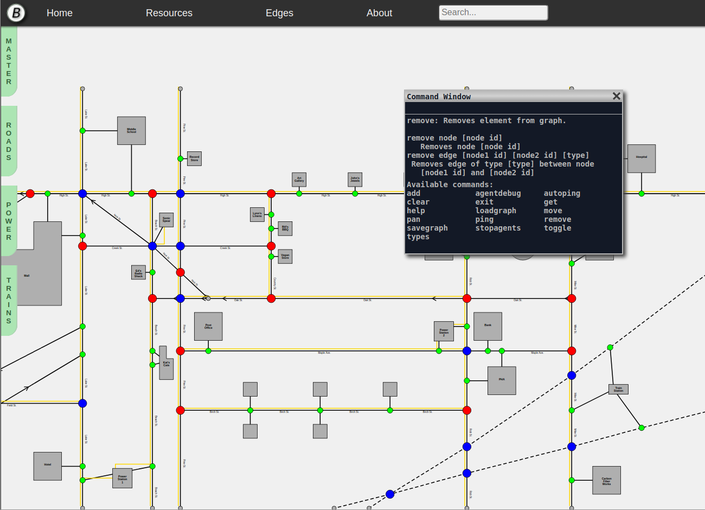

<h1>METI</h1>

<strong>Students:</strong> Lily Marvin, Katrina Sabochick, Nickolas Spear 
<strong>Past:</strong> Storme Charette 
<strong>Repository:</strong> <a href="https://github.com/maine-cyber/mcsc-unisim" target="_blank">mcsc-unisim on GitHub</a>

METI (Metropolitan Event Training Interface) is an interactive map of a city. It’s purpose is to simulate real-world events such as natural disasters, accidents, power outages, and malicious attacks. These simulations are then used to help train users in emergency response, and how to recognize the signs of potential attacks on everything from the power grid to the sewage.

In the beginning, METI was to be used as a visual interpreter of
<a href="{{ site.github.url }}/what-we-do/student-projects/Betaport/">Betaport</a>
, which is the MCSC virtual town used for cyber security training. As it developed, we realized the greater potential of the tool and instead began to expand, with the idea that it could be used as a stand-alone application for any virtual environment.

<figure>

<figcaption style="text-align:center">
METI's map view of a loaded city with an integrated command line open.
</figcaption>
</figure>

The progress that our team has made since METI began has been extraordinary. Starting from scratch, we have now developed the foundation and framework for the simulation engine using C and C++, including developing our own libraries to provide lightweight functionality. On the front end, we have created an interactive map with JavaScript and HTML that can already process user input and allow clients to create their own worlds, as seen above with our graph editor tool.

Right now, METI remains unconnected to Betaport or any existing virtual environment. Our next steps will be to continue improving the interface on the front end, and to fully implement the simulation engine, thus enabling us to connect METI to BetaPort and begin running simulations.

<a href="{{ site.github.url }}/what-we-do/student-projects/">Return to Student Projects</a>
